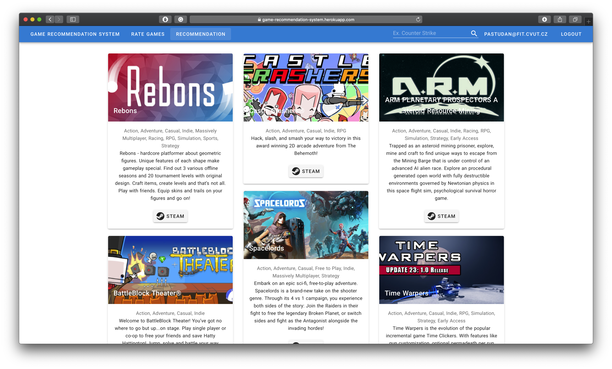

# Game recommendation system
The goal of the project was making a web application with a content-based recommendation system. All recommendations are based on the Steam games dataset (you can find it in `data` folder). In order to be able to get recommendations, the user must rate at least few games, then the system will have enough information to propose new games.  
Recommendation system is based on the genres and categories of games user likes/dislikes. It allows to get more relevant and 
various list of games.

The application is deloyed on `heroku.com`.

# How it looks like

# Technology
- Python (Flask, numpy, pandas)
- Nuxt.js
- MongoDB (cloud)

# Improvements 
There are at least few options how to improve relevance of the results:
- Use clustering algorithm to find similar games and use it to enhence the results
- Use more features
